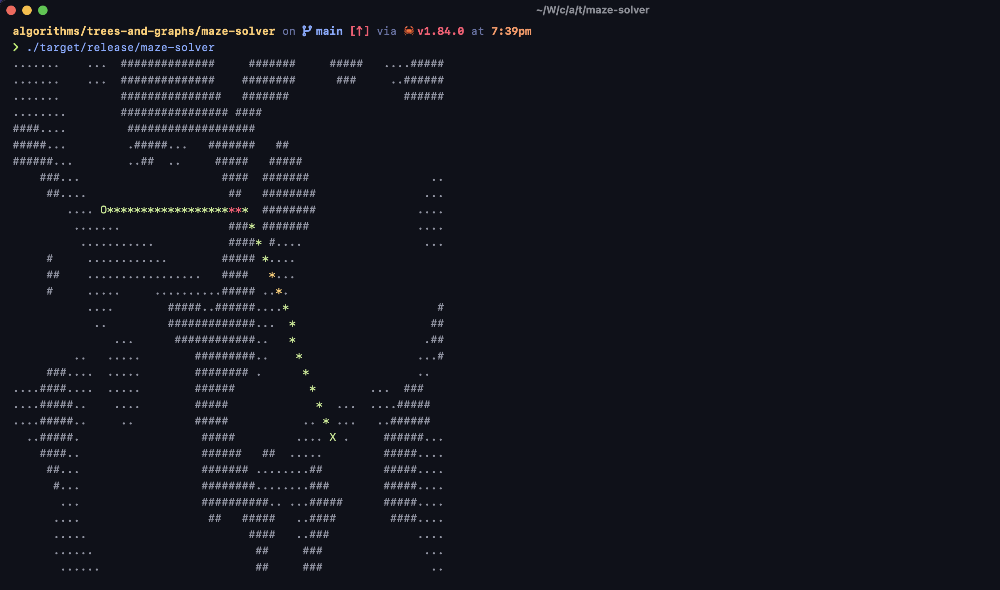

# Maze Solver

This code uses A* search to solve the provided small, medium, and large mazes. Those mazes
are made up of three kinds of 'terrain':

- `' '`, an open field that costs 1 to traverse
- `'.'`, a 'bog' that costs 3 to traverse
- `'#'`, a 'mountain' that costs 10 to traverse

Note that the starting and ending points are marked as `'O'` and `'X'`, respectively.

## Usage

Assuming you've pulled down this code and are in the same directory as this README, just use `cargo run`.
You can change the input file (small, medium, or large maze) by modifying the first line of `main` in
the code.

## Output

The program will print the solved map/maze, along with its route. Traversed tiles are marked with an `'o'`,
and are green for field, yellow for bog, or red for mountain.

