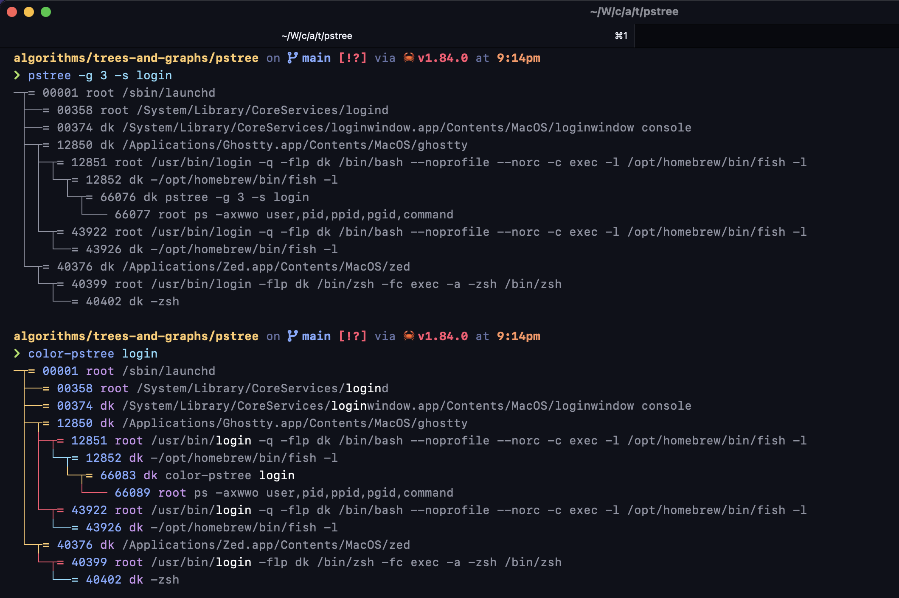

# color-pstree

This is a re-implementation of the most critical functionality of `pstree`. Besides being feature-equivalent to
`pstree -g 3 -s`, this implementation adds color. That includes:

- Coloring the first occurrence of any filter-matched text in a given process's command.
- Cycling between multiple colors on the tree itself, based on the level of nesting.

Despite the complexity introduced by ANSI color codes, the visible text still perfectly matches the width of the terminal.
(For both terminal width detection and adding color to text, I used the `crossterm` crate.)

## Usage

```bash
$ cargo install --path .
$ color-pstree
```

## Side-by-side with pstree


